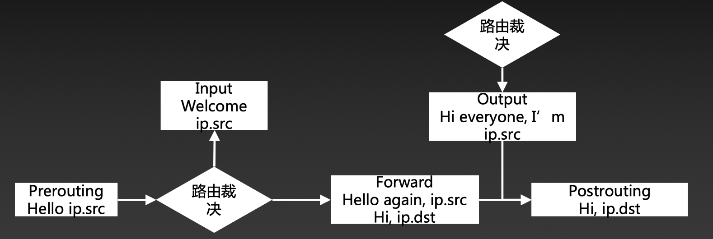

## Netfilter demo hello
本示例工作在ip层，在不同的hook点过滤数据包，并打印不同的问候语：


### 编译运行
```
## make编译，在当前生成目录下生成.ko模块文件
make
## 安装模块
sudo insmod hello_nf.ko
## 查看模块
sudo lsmod | grep hello_nf
## 查看dmesg,如果主机有网络通信能够看到问候信息
dmesg
## 卸载模块
sudo rmmod hello_nf
```